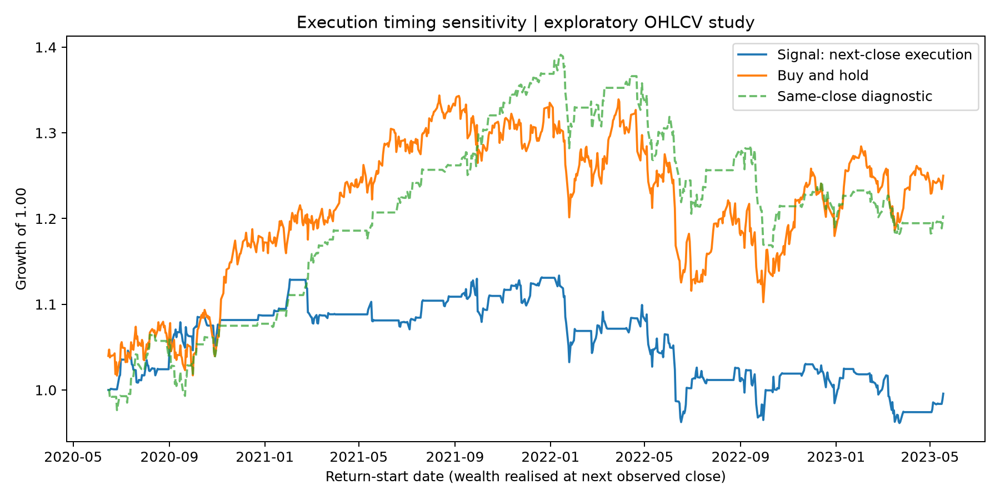
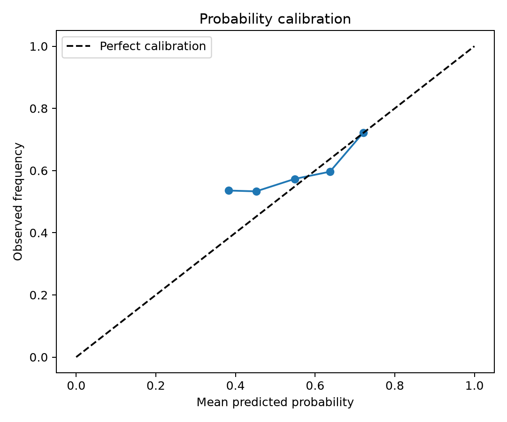

# quantitative-market-models

**Daily financial forecasts, from chronological prediction to execution assumptions.**

This scientific-Python study asks whether simple daily price-and-volume features improve direction forecasts over baselines, and whether any apparent trading value survives delayed execution and transaction costs.

The experiment follows one path: **data → features → walk-forward predictions → prediction quality and uncertainty → execution sensitivity → performance and drawdown**. Model comparison and trading use the same stored predictions. Results are exploratory: the historical sample has already been inspected, and there is no untouched final holdout.

**Current sample result:** across 741 evaluation rows (2020-06-15 to 2023-05-18), the random forest has AUC 0.525 but worse Brier loss than the training-frequency baseline (0.2511 versus 0.2465). Its net total return changes from 20.36% under the same-close diagnostic to −0.43% with a one-close delay, both at 5 bp turnover cost. The block-bootstrap loss-improvement intervals include zero. This sample establishes sensitivity to the trading clock, not a robust advantage. See the [generated summary](reports/summary.md).

The original source of the bundled CSV files is unknown. The [data record](data/README.md) distinguishes verified file facts from unresolved provenance. These files support an inspectable software example, not a validated investment claim.

## Run the study

From the repository root, using Python 3.12:

```bash
python3.12 -m venv .venv
source .venv/bin/activate
python -m pip install -r requirements-lock.txt
python -m pip install --no-deps -e .
python -m pytest -q
python scripts/run_analysis.py
```

The default `--study signal` runs the main experiment using local data, without credentials or network access. It overwrites the study's generated outputs in `reports/`. The lock file records the tested dependency versions; the [experiment guide](docs/experiment_guide.md) explains the configuration and interpretation.

## Inspect the evidence

| Question | Output |
|---|---|
| How do models compare on the same dates? | [Model comparison](reports/model_comparison.csv), [stored predictions](reports/predictions.csv) |
| How uncertain is the forest's Brier-loss improvement over training frequency? | [Paired block-bootstrap intervals](reports/prediction_uncertainty.csv) |
| What changes when execution is delayed by one close? | [Execution comparison](reports/execution_comparison.csv), [positions and returns](reports/signal_backtest.csv) |
| What produced this run? | [Run manifest](reports/run_manifest.json), [summary](reports/summary.md), [data manifest](data/manifest.json) |



*The delayed-close strategy uses the preceding observation's signal. The same-close calculation is an idealized timing diagnostic; observing final OHLCV does not establish that a trade can obtain that same close.*



*Calibration compares predicted probabilities with observed frequencies. Prediction quality and trading returns answer different questions; neither plot establishes a durable trading advantage.*

## Read the methods

- [Experiment guide](docs/experiment_guide.md): defaults, outputs, and how to interpret a run.
- [Methodology](docs/methodology.md): target alignment, training folds, forecast timing, and accounting.
- [Assumptions and limitations](docs/assumptions_and_limitations.md): data, inference, and execution boundaries.
- [Model cards](docs/model_cards.md), [architecture](docs/architecture.md), and [research roadmap](docs/research_roadmap.md).

Reusable functions live in `src/quant_models/`, the workflow in `scripts/run_analysis.py`, and numerical checks and regression cases in `tests/`. GitHub Actions runs tests, regenerates reports, and checks the supplementary C++ and JavaScript examples.

## Supplementary worked examples

The repository also contains portfolio allocation, one-day EWMA VaR, option pricing, stochastic simulation, time-series filters, and a small [text-retrieval demonstration](docs/ai_risk_notes.md). These are separate educational examples, not additional evidence for the forecasting strategy.

```bash
python scripts/run_analysis.py --study all
```

Smaller entry points are in `examples/`; supplementary implementations are in `cpp/`, `javascript/`, `r/`, and `sql/`. Optional downloads are described in the [data guide](data/README.md). A lead–lag benchmark is [future work](docs/research_roadmap.md), not an implemented result.

The software is MIT-licensed; this does not establish rights in the bundled data. Results are historical and hypothetical, not investment advice.
