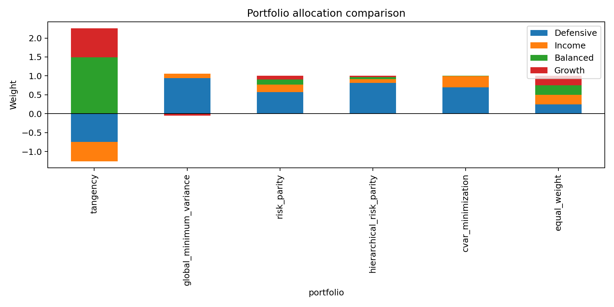
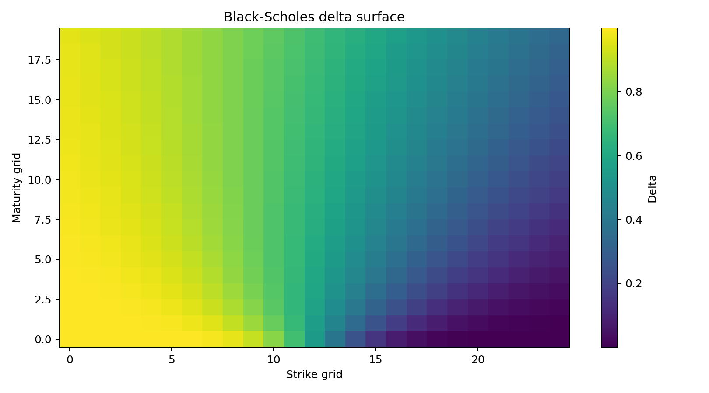

# Quant AI Research Lab

A reproducible research platform for portfolio construction, risk analytics, derivatives pricing, volatility modeling, and ML-based financial signal research.

This repository is built around one public portfolio identity: a scientific researcher who can turn mathematical ideas into clean, tested, explainable software. It is intentionally package-first rather than notebook-first.

## What It Demonstrates

- Quantitative finance: portfolio optimization, risk parity, CVaR allocation, VaR, Expected Shortfall, stress testing, derivatives pricing, Greeks, stochastic simulation, and numerical methods.
- Machine learning: baseline-first model comparison, walk-forward validation, feature engineering, calibration, feature importance, and no-lookahead backtesting.
- Software engineering: Python package structure, type-hinted functions, tests, CI, Docker, Makefile, CLI scripts, and multi-language implementations.
- Communication: recruiter summary, methodology notes, model cards, limitations, generated tables, and analyst-style figures.

## Example Outputs






## Main Features

- Data ingestion and validation for bundled sample data plus optional public-data download scripts.
- OHLCV feature engineering for time-series market prediction.
- Walk-forward classifiers: naive baseline, logistic regression, linear SVM, histogram gradient boosting, and random forest.
- Transaction-cost-aware long/flat backtesting with equity curves and drawdown.
- EWMA VaR, rolling Expected Shortfall, Kupiec VaR backtest, and stress scenarios.
- Portfolio construction: equal weight, tangency, global minimum variance, risk parity, hierarchical risk parity, and CVaR minimization.
- Derivatives: Black-Scholes, CRR binomial tree, Monte Carlo Asian option, implied volatility, and Greeks.
- Volatility and factor diagnostics: GARCH(1,1)-style conditional volatility and PCA statistical factors.
- Multi-language examples in C++, JavaScript, R, and SQL.

## Quick Start

```bash
python -m venv .venv
source .venv/bin/activate
pip install -e ".[dev]"
python scripts/run_analysis.py
pytest
```

Or use the Makefile:

```bash
make install
make analysis
make test
make cpp
make js
```

## Optional Data Downloads

The bundled data is sufficient to run all tests and reports. Optional refresh examples:

```bash
python scripts/download_data.py market --symbol spy.us --output data/downloaded/spy_stooq.csv
python scripts/download_data.py sec-facts --cik 0000320193 --output data/downloaded/apple_company_facts.json
```

SEC requests should use a real declared user-agent if you adapt the script for sustained use.

## Generated Reports

Running `python scripts/run_analysis.py` writes:

- `reports/summary.md` - concise research summary.
- `reports/metrics.json` - machine-readable metrics.
- `reports/model_comparison.csv` - baseline-first ML comparison.
- `reports/signal_backtest.csv` - predictions, positions, returns, and equity curves.
- `reports/stress_scenarios.csv` - scenario shocks and losses.
- `reports/portfolio_summary.csv` - allocation method comparison.
- `reports/option_greeks_surface.csv` - Black-Scholes Greek surface.
- `reports/figures/` - regenerated PNG charts.

## Repository Layout

```text
.
├── .github/workflows/ci.yml
├── cpp/
├── data/
├── docs/
├── examples/
├── javascript/
├── r/
├── reports/
├── scripts/
├── sql/
├── src/quant_models/
└── tests/
```

## Documentation

- [Recruiter summary](docs/recruiter_summary.md)
- [Methodology](docs/methodology.md)
- [Model cards](docs/model_cards.md)
- [Assumptions and limitations](docs/assumptions_and_limitations.md)
- [Architecture](docs/architecture.md)

## Tests and Code Quality

The test suite covers option-pricing convergence, portfolio constraints, risk diagnostics, no-lookahead feature construction, and backtest metrics. GitHub Actions runs Python tests, regenerates reports, compiles the C++ Monte Carlo pricer, runs the JavaScript option pricer, and performs a basic secret-string smoke test.

## Disclaimer

This is a research and software portfolio project. Results are historical and hypothetical. Nothing here is investment advice or a live trading recommendation.
