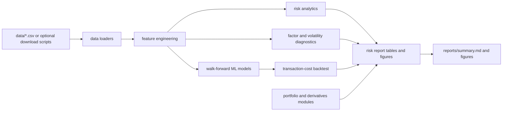

# Architecture

The code is organized as a small research platform: reusable package modules under `src/quant_models`, executable workflows under `scripts/`, communication artifacts under `docs/`, and generated outputs under `reports/`.
