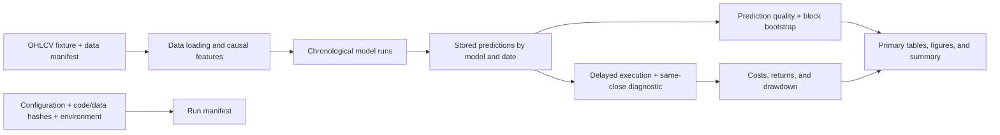

# Architecture

| Location | Responsibility |
|---|---|
| `src/quant_models/` | Reusable calculations with explicit inputs and returned values |
| `scripts/run_analysis.py` | Experiment configuration, orchestration, reports, and run metadata |
| `data/` | Bundled fixtures, observed file inventory, and unresolved provenance |
| `reports/` | Generated predictions, metrics, tables, figures, and run metadata |
| `tests/` | Numerical checks, timing invariants, and regression cases |
| `docs/` | Methods, interpretation, assumptions, and planned research |
| `examples/` | Smaller runnable demonstrations |

The default `--study signal` computes each classifier's predictions once, then derives model comparisons and the forest's trading calculations from them. Evaluation dates and fitted-model settings stay consistent across those outputs.

`--study all` also runs separate portfolio, risk, derivatives, time-series, retrieval, and numerical examples. Their descriptive fits and stylized inputs are not components of the trading strategy. Optional download scripts acquire separate datasets and do not explain the bundled files' origin.

The analysis script is the reproducible entry point; notebooks are optional narrative explorations. The current pipeline loads small files into memory and does not demonstrate distributed processing or production trading infrastructure.
